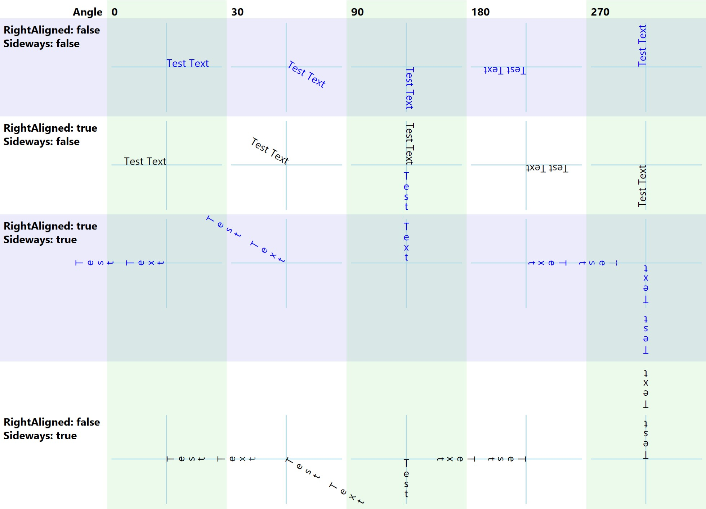
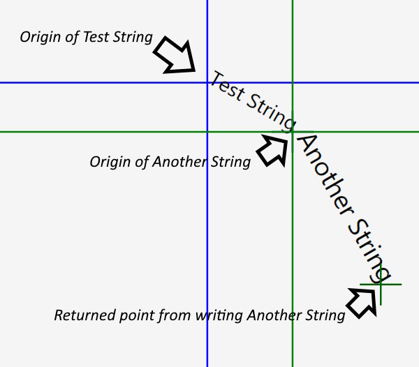

# Base WPF functionality for writing custom controls

## Table of content
[About](#about)  
[Sample](#sample)  
[GlyphDrawer](#GlyphDrawer)  
[Build requirements](#Build-requirements)  
[Structure CustomControlBaseLib Solution](#Structure-CustomControlBaseLib-Solution)  
[Project Status](#Project-Status)  
[Copyright](#Copyright)

## About

It can be quite a lot of work to support resizing, padding, different fonts, etc.
when you write a WPF custom control. The main class in the library `CustomControlBase` 
provides these functionalities and also drawing directly to the screen for your
custom control.
A few other methods in this library are also helpful when writing
WPF controls, like `GlyphDrawer` which allows to measure text length and
writing text directly to a Control's DrawingContext.

## Sample

`CustomControlBase` can be used for any custom control you write. `CustomControlSample` in 
`CustomControlSampleLib` provides a detailed example how to add `Visuals`, 
`FramworkElemtens`, `Controls`, etc. and how to directly 
draw to the screen can be easily combined. Left in the sample is a `TextBox` and right 
is a code drawn ellipse with the same (!) size like the TextBox. A possible use case would
be a graph together with a legend. 


One challenge here is the sizing and placing of the control's content, depending on Alignment (stretched or not), 
`TextBox.FontSize` and available space given by the Window. `CustomControlBase` and 
`CustomControlSample` also support Border and Padding. `Font` and `BackGround` are inherited in a custom 
control from `Control`, but they don't do anything out of the box. `CustomControlBase` adds the missing 
functionality.

## GlyphDrawer

Displaying some string to the user is easiest done in WPF by using `TextBox`. However, `TextBox` 
comes with the overhead which every `FrameworkElement` has: participating in the visual tree, 
support of mouse, tons of properties and events, templating support and much more, but 
sometimes we just want to write something without all this overhead. Especially when you know 
the pixel position within a `FrameworkElement`, you can just write the string to the `DrawingContext` 
of that `FrameworkElement`. It is kind of difficult to write to a precise location using a `TextBox`.

**Note**: This code works for anything inheriting from `UIElement`, except `Window`. It seems 
the `Window` paints its `Background` over everything that gets written in `OnRender()`.

Writing a string in the overridden `OnRender()` method using its `DrawingContext` is much more 
efficient. There are 2 ways writing strings to the `DrawingContext`

**DrawingContext.DrawText(FormattedText, Point)**

This requires a `FormattedText` which is complex and has lots of properties. The 
implementation is complicated, because it has to cater for all kinds of complicated 
formatting. It translates the `FormattedText` into a `GlyphRun` and calls 
`DrawingContext.DrawGlyphRun()` internally. 

**DrawingContext.DrawGlyphRun(Brush, GlyphRun)** 

A glyph defines the shape of a character, also width and height, which depends on font 
attributes like:

+ FontFamily
+ FontStyle
+ FontWeight
+ FontStretch
+ PixelsPerDip

**Note:** FontSize is not part of these properties. The calculation for the actual distance 
from this to the next glyph is: GlyphWidth * FontSize

A `GlyphRun` contains the font attributes listed above. They are used to paint every glyph, 
which are also stored in the `GlyphRun` plus the distance between this glyph and the next 
glyph (=`AdvanceWidth`). We can spread characters, since we specify the width each glyph uses.

Creating your own `GlyphRun` is a bit of a headache. For example, how do you know the 
distance between 2 glyphs ?

For that, you need to construct a `GlyphTypeface`. You construct it like this:

```
var typeface = new Typeface(fontFamily, fontStyle, fontWeight, fontStretch);
if (!typeface.TryGetGlyphTypeface(out glyphTypeface))
  throw new InvalidOperationException("No GlyphTypeface found")
//convert the character '?' to glyph index
var glyphIndex = glyphTypeface.CharacterToGlyphMap[(int)'?'];
var distanceToNextGlyph = glyphTypeface.AdvanceWidths[glyphIndex] * FontSize;
```

`DrawingContext.DrawText()` is doing all this and much more. So why not using just 
`DrawingContext.DrawText()` ? Because it is inefficient and leads to ugly code. Writing 
just 2 strings looks like this:

```
FormattedText formattedText = new FormattedText("some string", 
  CultureInfo.GetCultureInfo("en-us"), FlowDirection.LeftToRight, 
  new Typeface("Verdana"), 32, Brushes.Black);
DrawingContext.DrawText(formattedText, new Point(10, 10));

FormattedText formattedText = new FormattedText("another string",
  CultureInfo.GetCultureInfo("en-us"), FlowDirection.LeftToRight,
  new Typeface("Verdana"), 36, Brushes.Gray);
DrawingContext.DrawText(formattedText, new Point(10, 50));
```

If you write several strings all using the same font attributes, you have to repeat that 
code for every string, and worst of all, `DrawText()` creates the same `GlyphTypeface` again 
and again, which is a big object holding the calculations for thousands of glyphs.

Wouldn't it be nicer you could write code like this and not causing the inefficiency of 
`DrawText()`:

```
var glyphDrawer = new GlyphDrawer(FontFamily, FontStyle, FontWeight, 
  FontStretch, VisualTreeHelper.GetDpi(this).PixelsPerDip);
glyphDrawer.Write(drawingContext, new Point(10, 10), "some string", 32, Brushes.Black);
glyphDrawer.Write(drawingContext, new Point(10, 50), "another string", 36, Brushes.Gray);
```

`GlyphDrawer` stores the `GlyphTypeface` and reuses it for every write. 

### How to use the GlyphDrawer

As shown above, creating a `GlyphDrawer` is easy. You can use `FontFamily`, `FontStyle`, 
`FontWeight`, `FontStretch`, which are properties of the the control you write your string 
into. Or you can use other values like  FontWeights.Bold  .

```
GlyphDrawer glyphDrawer= new GlyphDrawer(FontFamily, FontStyle, FontWeights.Bold,
  FontStretch, VisualTreeHelper.GetDpi(this).PixelsPerDip);

protected override void OnRender(DrawingContext drawingContext) {
  glyphDrawer.Write(drawingContext, new Point(10, 10), "some string", 32, Brushes.Black);
  glyphDrawer.Write(drawingContext, new Point(10, 50), "another string", 36, Brushes.Gray);
}
```

  GlyphDrawer.Write()  looks actually like this:

```
public void Write(
  DrawingContext drawingContext,
  Point origin,
  string text,
  double size, //font size
  Brush brush, 
  bool isRightAligned = false,
  bool isSideways = false,
  double angle = 0) //text can be rotated, in degrees, clockwise
```

Some of the parameter's meanings are obvious, others are easier to understand when seen how 
the result looks like.



Using the same `GlyphDrawer`, you can write strings with different font sizes, colours, 
left & right alignments, sideways or not (see above) and rotation angles. However, if you 
want to write some text normal and some in bold, you need to use 2 `GlyphDrawer` instances, 
one created with `FontWeight.Normal` and the other with `FontWeight.Bold`. The same applies if 
you need different FontFamilies, FontStyles (italic) or FontStretches.

Your code executes faster if you create the `GlyphDrawer` in the Control's constructor 
instead recreating it every time `OnRender()` gets called.

Once you have created the `GlyphDrawer`, you can use it to write strings with 
`GlyphDrawer.Write()`. The `origin` parameters indicate where the text should be written. 
`origin.X` points at the leftmost position where the string should start if the string is 
left aligned. For right aligned strings (numbers) `origin.X` points at the rightmost 
position. `origin.Y` points at where the lowest glyph pixel gets written (baseline). Note 
that some characters like 'g' paint some pixels under the baseline.



`GlyphDrawer.Write()` returns a point, which can be used to write the next 
string. This is especially convenient, when the text is rotated and the x 
and y calculation is complicated.

```
var nextPoint = glyphDrawer.Write(drawingContext, new Point(x, y), "Test String", 12, 
  Foreground, angle: 30);
nextPoint = glyphDrawer.Write(drawingContext, nextPoint," Another String", 15, 
  Foreground, angle: 60);
```

It would be extremely difficult to do this with `TextBoxes` and also doing 
this with `DrawingContext.DrawText()` is not trivial. Furthermore, using 
`GlyphDrawer.Write()` executes about 5 times faster than 
`DrawingContext.DrawText()`, i.e 0.04 milliseconds versus 0.2 ms.

**Few limitations of GlyphDrawer**

Painting Unicode can be very complex, like mixing left to right (English) 
and right to left (Arabic) in the same string. There is support for this in 
the .Net framework, but it is not included in `GlyphDrawer`, because all the 
text I work with is in english. There might also be some other exotic 
features in  Unicode which I have not encountered. 


## Build requirements
net5.0-windows or later

## Structure Solution CustomControlBaseLib

### Library CustomControlBaseLib
The only library needed to be referenced from your own code, providing:
#### Class CustomControlBase
Base class for custom controls with functionality added for `Children`, drawing, `Border`, `Padding` 
and `Background`.
#### Helper Class GlyphDrawer
Writes text to a `DrawingContext`. Can also be used to calculate the length of text.
#### Helper Class DependencyObjectExtensions
Contains the methods `FindVisualChildren()` and `FindVisualChild()`
### Library CustomControlSampleLib
The class `CustomControlSample.cs` shows how to use the class `CustomControlBase` with detailed 
instructions. Copy `CustomControlSample` code into your own custom control when you start to write it.
### Library CustomControlSample
WPF Core application displaying `CustomControlSample`

## Project Status
Completed and stable

## Copyright
Copyright 2020 Jürg Peter Huber, Singapore.

Licensed under the [Creative Commons 0 license](COPYING.txt)

