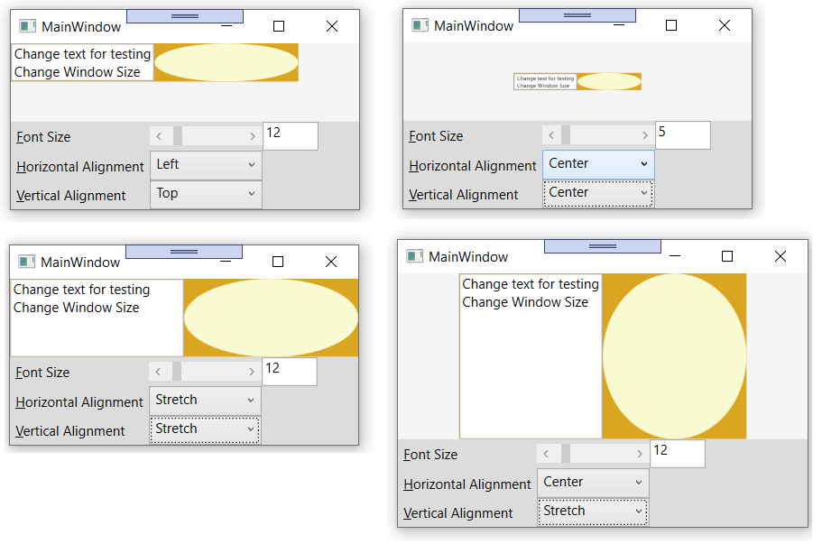

# Base WPF functionality for writing custom controls

## Table of content
[About](#about)  
[Sample](#sample)  
[Build requirements](#Build-requirements)  
[Structure CustomControlBaseLib Solution](#Structure-CustomControlBaseLib-Solution)  
[Project Status](#Project-Status)  
[Copyright](#Copyright)

## About

It can be quite a lot of work to support resizing, padding, different fonts, etc.
when you write a WPF custom control. The main class in the library `CustomControlBase` 
provides these functionalities and also drawing directly to the screen for your
custom control.
A few other methods in this library are also helpful when writing
WPF controls, like `GlyphDrawer` which allows to measure text length and
writing text directly to a Control's DrawingContext.

## Sample

`CustomControlBase` can be used for any custom control you write. `CustomControlSample` in 
`CustomControlSampleLib` provides a detailed example how to add `Visuals`, 
`FramworkElemtens`, `Controls`, etc. and how to directly 
draw to the screen can be easily combined. Left in the sample is a `TextBox` and right 
is a code drawn ellipse with the same (!) size like the TextBox. A possible use case would
be a graph together with a legend. 

One challenge here is the sizing and placing of the control's content, depending on Alignment (stretched or not), 
`TextBox.FontSize` and available space given by the Window. `CustomControlBase` and 
`CustomControlSample` also support Border and Padding. `Font` and `BackGround` are inherited in a custom 
control from `Control`, but they don't do anything out of the box. `CustomControlBase` adds the missing 
functionality.

## Build requirements
.Net Core 3.1 or later

## Structure Solution CustomControlBaseLib

### Library CustomControlBaseLib
The only library needed to be referenced from your own code, providing:
#### Class CustomControlBase
Base class for custom controls with functionality added for `Children`, drawing, `Border`, `Padding` 
and `Background`.
#### Helper Class GlyphDrawer
Writes text to a `DrawingContext`. Can also be used to calculate the length of text.
#### Helper Class DependencyObjectExtensions
Contains the methods `FindVisualChildren()` and `FindVisualChild()`
### Library CustomControlSampleLib
The class `CustomControlSample.cs` shows how to use the class `CustomControlBase` with detailed 
instructions. Copy `CustomControlSample` code into your own custom control when you start to write it.
### Library CustomControlSample
WPF Core application displaying `CustomControlSample`

## Project Status
Completed and stable

## Copyright
Copyright 2020 Jürg Peter Huber, Singapore.

Licensed under the [Creative Commons 0 license](COPYING.txt)

